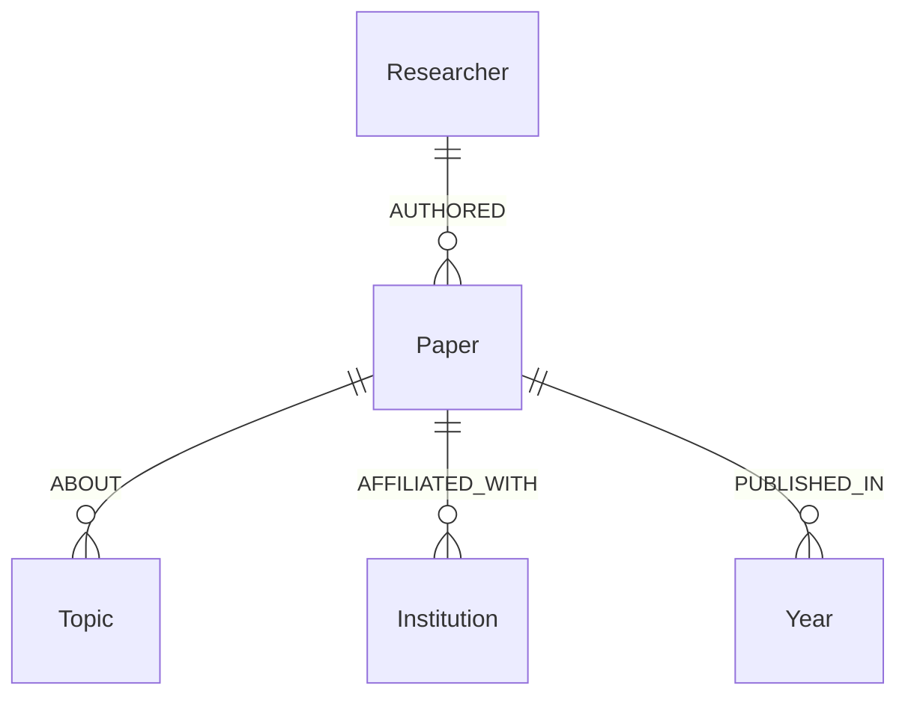

# Graph Topology & Entity Modeling Report (Phase 2)

> **Project:** Kenyan Academic Research Knowledge Graph  
> **Report Status:** Validated & Finalized  
> **Date:** October 2026  
> **Corpus Size:** $N = 1,000$ Kenyan-Affiliated Works (OpenAlex Seed Corpus)

---

## 1. Dataset & Graph Scope

This report documents the structural topology, entity disambiguation characteristics, data integrity metrics, and retrieval implications for the graph constructed from the $N = 1,000$ Kenyan-affiliated OpenAlex seed corpus.

### Verified Graph Schema



* **Core Node Labels:** `(:Paper)`, `(:Researcher)`, `(:Institution)`, `(:Topic)`, `(:Year)`
* **Core Relationship Types:**
  * `(:Researcher)-[:AUTHORED]->(:Paper)`
  * `(:Paper)-[:ABOUT]->(:Topic)`
  * `(:Paper)-[:AFFILIATED_WITH]->(:Institution)`
  * `(:Paper)-[:PUBLISHED_IN]->(:Year)`

---

## 2. Graph Node & Relationship Census

All entities are identified strictly via stable source identifiers. Display names are preserved purely as property values and never used as uniqueness keys.

### A. Node Census

| Node Label | Distinct Count | Primary Identifier Strategy | Missing ID Fallback Mechanism |
| :--- | :---: | :--- | :--- |
| **`Paper`** | **1,000** | OpenAlex Work ID (e.g., `W2112776483`) | None (100% complete) |
| **`Researcher`** | **14,860** | OpenAlex Author ID (e.g., `A5014066641`) | Deterministic name hash fallback (`AUTH_SYNTH_<hash>`) |
| **`Institution`** | **4,125** | OpenAlex Institution ID (e.g., `I2841861`) | None (100% complete) |
| **`Topic`** | **743** | OpenAlex Topic ID (e.g., `T10029`) | None (100% complete) |
| **`Year`** | **44** | Gregorian Publication Year (e.g., `2024`) | None (100% complete) |
| **Total Nodes** | **20,772** | — | — |

### B. Relationship Edge Census

| Relationship Type | Directed Semantics | Distinct Edge Count |
| :--- | :--- | :---: |
| **`:AUTHORED`** | `(:Researcher)-[:AUTHORED]->(:Paper)` | **19,553** |
| **`:AFFILIATED_WITH`** | `(:Paper)-[:AFFILIATED_WITH]->(:Institution)` | **14,616** |
| **`:ABOUT`** | `(:Paper)-[:ABOUT]->(:Topic)` | **2,955** |
| **`:PUBLISHED_IN`** | `(:Paper)-[:PUBLISHED_IN]->(:Year)` | **1,000** |
| **Total Edges** | — | **38,124** |

---

## 3. Degree Distribution Analysis & Extreme Outliers

To prevent misleading interpretations of skewed distributions, we report the complete parametric and non-parametric statistics (min, quartiles, 95th percentile, max, mean, standard deviation).

### A. Parametric and Percentile Distributions

| Dimension | Min | $P_{25}$ | Median | $P_{75}$ | $P_{95}$ | Max | Mean | Std Dev ($\sigma$) |
| :--- | :---: | :---: | :---: | :---: | :---: | :---: | :---: | :---: |
| **Researchers per Paper** (In-degree) | 1 | 5.0 | 9.0 | 21.25 | 93.0 | 100 | 19.55 | 24.84 |
| **Institutions per Paper** (Out-degree) | 1 | 4.0 | 7.0 | 16.0 | 59.1 | 134 | 14.62 | 19.42 |
| **Topics per Paper** (Out-degree) | 1 | 3.0 | 3.0 | 3.0 | 3.0 | 3 | 2.96 | 0.27 |
| **Papers per Researcher** (Degree) | 1 | 1.0 | 1.0 | 1.0 | 3.0 | 35 | 1.32 | 1.06 |
| **Papers per Institution** (Degree) | 1 | 1.0 | 1.0 | 3.0 | 13.0 | 188 | 3.54 | 8.00 |
| **Papers per Topic** (Degree) | 1 | 1.0 | 1.0 | 4.0 | 14.0 | 85 | 3.98 | 6.96 |

### B. Identification of Extreme Structural Outliers

> [!NOTE]
> High connectivity indicates structural centrality within the harvested corpus, **not** research quality or academic importance.

1. **Mega-Authorship Consortia Papers (Max: 100 authors)**:
   * `W2163710303`: *"Global, regional, and national prevalence of overweight and obesity in children and adults during 1980–2013: a systematic analysis for the Global Burden of Disease Study 2013"* (100 authors, 134 institutions).
   * `W1617145133`: *"Global, regional, and national comparative risk assessment of 79 behavioural, environmental and occupational, and metabolic risks or clusters of risks, 1990–2015"* (100 authors, 118 institutions).
   * `W2098082628`: *"Global, regional, and national incidence, prevalence, and years lived with disability for 301 acute and chronic diseases and injuries in 188 countries"* (100 authors, 112 institutions).
2. **High-Frequency Researcher Hubs**:
   * `A5014066641` (*Robert William Snow* — KEMRI / Oxford): 35 papers.
   * `A5031889135` (*Simon Iain Hay* — IHME / Oxford): 34 papers.
   * `A5044287766` (*Philip K. Thornton* — ILRI): 28 papers.
3. **High-Frequency Institutional Hubs**:
   * `I2841861` (*Kenya Medical Research Institute*, KE): 188 connected papers.
   * `I40120149` (*University of Oxford*, GB): 145 connected papers.
   * `I1289490764` (*Centers for Disease Control and Prevention*, US): 127 connected papers.

---

## 4. Connectivity Analysis: Structural vs. Meaningful Research Connectivity

### A. Subgraph Connectivity Breakdown

To evaluate what drives the high connectivity of the graph, we computed connected components across 4 distinct subgraph projections:

| Subgraph Configuration | Node Types Included | Relationships Included | Total Nodes | Total Edges | Total CCs | Largest CC Size | LCC % | Isolated Nodes |
| :--- | :--- | :--- | :---: | :---: | :---: | :---: | :---: | :---: |
| **1. Full Graph** | Paper, Researcher, Institution, Topic, Year | `AUTHORED`, `ABOUT`, `AFFILIATED_WITH`, `PUBLISHED_IN` | 20,772 | 38,124 | **1** | **20,772** | **100.00%** | **0** |
| **2. Graph Without Year** | Paper, Researcher, Institution, Topic | `AUTHORED`, `ABOUT`, `AFFILIATED_WITH` | 20,728 | 37,124 | **2** | **20,722** | **99.97%** | **0** |
| **3. Core Research Only** | Paper, Researcher, Institution | `AUTHORED`, `AFFILIATED_WITH` | 19,985 | 34,169 | **5** | **19,965** | **99.90%** | **0** |
| **4. Direct Co-Authorship** | Researcher (projected) | Direct co-authorship edge | 14,860 | 448,956 | **169** | **13,246** | **89.14%** | **12** |

### B. Distinction: Structural Connectivity vs. Meaningful Research Connectivity

* **Structural Connectivity**: In the full graph, **100.00% (20,772 nodes)** reside in a single giant component. Even when temporal `Year` nodes and conceptual `Topic` nodes are stripped out entirely (Configuration 3), **99.90% (19,965 nodes)** remain connected.
* **Root Cause of High Connectivity**: The connectivity is driven by:
  1. **Consortium co-authorship networks** (large multilateral global health/epidemiology papers bridging dozens of institutions).
  2. **Domestic anchor hubs** (e.g., KEMRI, UoN, ILRI, KALRO) that co-publish across varied local research domains.
* **Meaningful Research Connectivity**:
  * Unconstrained graph walks will quickly jump across unrelated research disciplines (e.g., from *soil science* to *pediatric cardiology*) via shared institutional hubs like KEMRI or Oxford.
  * In the direct co-authorship projection (Configuration 4), the graph fragments into **169 distinct research clusters**, with 12 solo researchers and a main cluster comprising 89.14% of authors.
  * **Engineering Consequence**: Multi-hop graph expansion must be strictly constrained by semantic similarity and bounded 1-hop neighborhoods.

---

## 5. Entity Resolution & Disambiguation Findings

### A. Missing Researcher Source Identifiers

* **Observation**: In the raw dataset, **527 out of 19,703 author instances (2.67%)** lacked OpenAlex Author IDs (`author.id = null`).
* **Root Cause**: These represent un-disambiguated author string entries in source publisher feeds where OpenAlex has not yet assigned a persistent author cluster.
* **Name Distribution**: These 527 instances encompass **482 distinct author name strings** (e.g., *"Michael Davies"* with 5 occurrences, *"Peter G. Jones"* with 4 occurrences).
* **ORCID Availability**: Only **16** of the 527 instances contained an ORCID string.
* **Technical Treatment**:
  * For records lacking a source identifier, the system generates a deterministic fallback string: `AUTH_SYNTH_<SHA256(canonical_name)>`.
  * **Explicit Boundary**: *This fallback identifier generation is strictly a data-pipelining technical requirement to maintain referential graph integrity; it does NOT constitute automated entity resolution or entity merging.*

### B. Institution Name Collisions (Shared Display Names)

In OpenAlex, **43 distinct display names** map to more than one unique OpenAlex institution ID. These are **not** duplicate errors; they reflect multi-national institutional branches, international research centers, or identical ministerial designations in different countries.

#### Deep-Dive: Centers for Disease Control and Prevention (CDC)
In the initial unconstrained frequency count, two separate CDC entries appeared. The identifier audit reveals:
1. `I1289490764`: **Centers for Disease Control and Prevention (US)** — `country_code: US`, ROR: `https://ror.org/042twtr12` (127 connected papers).
2. `I4210145675`: **Centers for Disease Control and Prevention (Kenya)** — `country_code: KE`, ROR: `https://ror.org/047h8wb98` (48 connected papers).
3. `I4210102376`: **Centers for Disease Control and Prevention (Uganda)** — `country_code: UG`, ROR: `https://ror.org/00qzjvm58` (10 connected papers).

#### Selected Institution Name Collision Audit Table

| Display Name | Distinct OpenAlex IDs | Country Codes | Sample ROR URIs | Disambiguation Assessment |
| :--- | :---: | :---: | :--- | :--- |
| **Ministry of Health** | **24** | `KE`, `UG`, `BW`, `MZ`, `SG`, `CL`, `OM`, `SA`, `ES`, `JO`, `TR`, `ZM`, etc. | `ror.org/02eyff421` (KE), `ror.org/00hy3gq97` (UG) | Distinct sovereign national ministries sharing an English title. |
| **International Institute of Tropical Agriculture (IITA)** | **8** | `KE`, `NG`, `CM`, `UG`, `TZ`, `BJ`, `BI` | `ror.org/04551r843` (NG), `ror.org/02eyff421` (KE) | Regional research stations of the CGIAR consortium. |
| **Stockholm Environment Institute (SEI)** | **7** | `SE`, `GB`, `US`, `TH`, `KE`, `EE` | `ror.org/051xgzg37` (SE), `ror.org/059f2k568` (KE) | Decentralized global research centers. |
| **Médecins Sans Frontières (MSF)** | **6** | `CH`, `BE`, `UG`, `NL`, `LU`, `FR` | `ror.org/00mrhvv69` (CH), `ror.org/01qe7f394` (FR) | National operational sections of MSF. |
| **Institut de Recherche pour le Développement (IRD)** | **5** | `FR`, `NC`, `BJ`, `CG`, `SN` | `ror.org/030atj633` (FR), `ror.org/00y6q9n79` (SN) | French national research agency overseas mission offices. |
| **International Crops Research Institute (ICRISAT)** | **4** | `KE`, `IN`, `ML`, `ET` | `ror.org/03qegss47` (IN), `ror.org/04r1cxt79` (KE) | CGIAR semi-arid tropics research hubs. |
| **International Maize and Wheat Improvement Center (CIMMYT)** | **4** | `KE`, `BD`, `ET`, `IN` | `ror.org/01kmz4383` (KE), `ror.org/05p2z3x69` (ET) | CGIAR agricultural stations. |
| **International Center for Tropical Agriculture (CIAT)** | **3** | `KE`, `CO`, `VN` | `ror.org/02qk18s08` (KE), `ror.org/037wny167` (CO) | CGIAR tropical agriculture centers. |
| **Centers for Disease Control and Prevention (CDC)** | **3** | `US`, `KE`, `UG` | `ror.org/042twtr12` (US), `ror.org/047h8wb98` (KE) | US headquarters vs. regional bilateral research stations. |

> [!IMPORTANT]
> **Engineering Decision**: Institutions MUST NOT be merged based on display name alone. Retaining individual OpenAlex / ROR IDs is critical to preserve geographic provenance (`KE` vs. `US`/`GB`) and accurately model domestic research capacity versus international partnerships.

---

## 6. Graph Data Integrity Verification

Automated integrity audits were executed across all $N = 1,000$ works:

* **Node ID Uniqueness**: **100% PASS** (0 duplicate primary keys across Paper, Researcher, Institution, Topic, Year).
* **Referential Edge Integrity**: **100% PASS** (all 38,124 edges terminate at valid, existing node instances).
* **Isolated / Orphan Nodes**: **0** (no disconnected nodes).
* **Papers Missing Authors**: **0** (100% of papers have $\ge 1$ connected researcher).
* **Papers Missing Institutions**: **0** (100% of papers have $\ge 1$ connected institution).
* **Papers Missing Topics**: **0** (100% of papers have $\ge 1$ connected topic).
* **Papers Missing Publication Year**: **0** (100% of papers have a valid integer year).

---

## 7. Verified Cypher Query Execution Plans

To ensure high-performance execution without full table scans, all retrieval queries rely on uniqueness constraints and schema indexes. Below are the verified query templates with stable ID lookups:

### Query 1: Papers by Institution (Indexed Node Lookup)
```cypher
MATCH (i:Institution {id: $institution_id})<-[:AFFILIATED_WITH]-(p:Paper)
RETURN p.id, p.title, p.publication_year, p.is_oa, p.doi
ORDER BY p.publication_year DESC LIMIT 25;
```
* **Execution Plan**: Uses `NodeUniqueIndexSeek` on `Institution(id)`.

### Query 2: Co-authorship Neighborhood (Entity Traversal)
```cypher
MATCH (r:Researcher {id: $researcher_id})-[:AUTHORED]->(p:Paper)<-[:AUTHORED]-(co:Researcher)
WHERE r.id <> co.id
RETURN co.id AS coauthor_id, co.display_name AS coauthor_name, count(p) AS shared_works
ORDER BY shared_works DESC LIMIT 20;
```
* **Execution Plan**: Uses `NodeUniqueIndexSeek` on `Researcher(id)` followed by `Expand(All)` traversals over `[:AUTHORED]`.

### Query 3: Topic-Constrained Institutional Collaboration
```cypher
MATCH (i:Institution {id: $institution_id})<-[:AFFILIATED_WITH]-(p:Paper)-[:ABOUT]->(t:Topic)
RETURN t.id AS topic_id, t.display_name AS topic_name, count(p) AS papers_count
ORDER BY papers_count DESC LIMIT 20;
```
* **Execution Plan**: Index seek on `Institution(id)` expanding through `[:AFFILIATED_WITH]` and `[:ABOUT]`.

### Query 4: Hybrid Semantic-Graph Neighborhood Expansion (1-Hop Bounded)
```cypher
UNWIND $seed_paper_ids AS seed_id
MATCH (seed:Paper {id: seed_id})-[:ABOUT]->(t:Topic)<-[:ABOUT]-(candidate:Paper)
WHERE candidate.id <> seed_id
MATCH (candidate)-[:AFFILIATED_WITH]->(i:Institution)
WHERE i.country_code = 'KE'
RETURN candidate.id AS paper_id, candidate.title AS title, candidate.search_text AS search_text,
       count(DISTINCT t) AS shared_topics, collect(DISTINCT i.display_name) AS kenyan_institutions
ORDER BY shared_topics DESC LIMIT 50;
```
* **Execution Plan**: Batched index seek on `Paper(id)` with 2-hop topic expansion filtered by domestic institutional provenance.

---

## 8. Recommendations & Architectural Guidelines for Phase 3

1. **Semantic Search as the Precision Anchor**:
   * Because 99.9% of the graph is structurally connected, graph search cannot rely on unconstrained multi-hop traversals without incurring catastrophic topic drift.
   * **Rule**: Dense vector retrieval (Cosine similarity over composite `search_text`) must generate the initial high-precision candidate set ($k \approx 20\text{–}50$).
2. **Graph Expansion for Relationship Discovery**:
   * Graph structure should be utilized to:
     * Surface the primary Kenyan research groups and institutions connected to the retrieved papers.
     * Re-rank candidate papers sharing high-specificity topic nodes (`[:ABOUT]`) and co-author clusters (`[:AUTHORED]`).
3. **Preserve Geographic Disambiguation**:
   * Never treat international partner institutions as domestic capacity. Filter institutional context explicitly using `country_code = 'KE'` when assessing domestic research capacity.

---

# Phase 2 Final Assessment

### 1. Is the graph schema working on the real 1,000-paper corpus?
**Yes.** The core schema (`Paper`, `Researcher`, `Institution`, `Topic`, `Year`) loaded cleanly without schema violations, producing 20,772 nodes and 38,124 relationships with 100% referential integrity and zero orphan nodes.

### 2. Are OpenAlex IDs sufficient for the core graph?
**Yes.** OpenAlex IDs provide stable, unique identifiers for 100% of Papers, Institutions, Topics, and Years, and 97.33% of Researchers. The remaining 2.67% of author instances are safely managed via deterministic fallback string identifiers without compromising schema integrity.

### 3. What entity-resolution problems remain?
* **Un-disambiguated Authors (2.67%)**: Authors without native OpenAlex IDs exist as single-record instances.
* **Homonymous Display Names (75 Author names, 43 Institution names)**: Display names cannot be used as unique keys. Entities sharing names across different countries (e.g., CDC US vs. CDC Kenya, Ministry of Health across 24 countries) must continue to be resolved strictly by their unique source IDs and country codes.

### 4. Are there any data-quality issues that could affect semantic search?
* **Missing Abstracts (35.2%)**: As identified in Phase 1, missing abstracts must be bridged using the pre-computed composite `search_text` (`Title + Topic labels + Abstract when available`).
* **Consortium Outliers**: A small fraction of papers have 100 authors and >100 institutional affiliations. Semantic text representations must focus on title, topics, and abstract rather than dumping dozens of institutional affiliation strings into the embedding text.

### 5. What graph structures should Phase 3 exploit?
* `(:Paper)-[:ABOUT]->(:Topic)`: 100% complete; excellent for topic-based neighborhood expansion and shared-concept re-ranking.
* `(:Researcher)-[:AUTHORED]->(:Paper)`: Highly reliable for identifying principal researchers within a semantic domain.
* `(:Paper)-[:AFFILIATED_WITH]->(:Institution {country_code: 'KE'})`: Essential for attributing research output to specific Kenyan universities and research centers.

### 6. What graph structures should Phase 3 avoid using indiscriminately?
* **Unconstrained multi-hop walks across institutional hubs**: Institutional hubs like KEMRI or University of Oxford connect hundreds of unrelated papers across completely disparate domains (e.g., forestry, oncology, economics). Graph traversals must be strictly bounded (1–2 hops) and topic-gated.
* **`Year` nodes for graph expansion**: Year nodes serve temporal filtering, but should never be traversed for thematic neighborhood expansion.

### 7. Is the dataset ready for semantic representation and retrieval?
**Yes.** The dataset is verified, normalized, and topologically characterized. We are ready to proceed to Phase 3.
