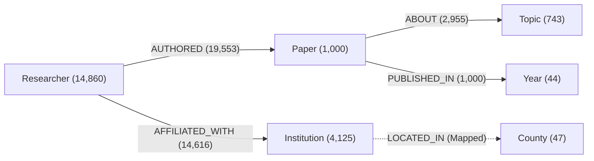
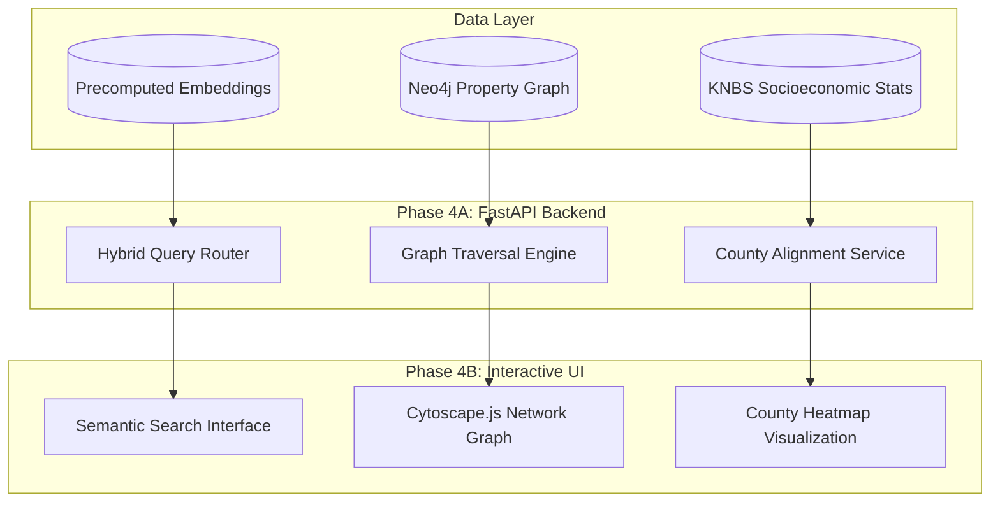

# Kenyan Academic Research Knowledge Graph
## Technical Progress & Engineering Audit Report (Phases 1–3)

**Author:** Lead Research Engineer  
**Project:** Final-Year Capstone Project (4.1) — *Kenyan Academic Research Knowledge Graph*  
**Date:** October 2026  
**Corpus SHA-256:** `580cb7583725f41e89f60ac25e1a28930d6961509142048b77c733f8c223cb6d`  
**Evaluation Benchmark:** 25 Multi-Domain Queries | 496 Graded Query-Candidate Pairs (Human Qrels)

---

## Executive Summary

This repository implements an end-to-end knowledge discovery platform for Kenyan academic literature. Over Phases 1 through 3, we constructed a normalized 1,000-paper corpus spanning four national priority research domains (Health, Agriculture, Economics/FinTech, and Climate/Ecology), built an entity-resolved heterogeneous property graph in Neo4j (20,772 nodes, 38,124 edges), and established a rigorous information retrieval (IR) evaluation harness benchmarking Lexical (BM25), Dense Semantic Vector (`BAAI/bge-small-en-v1.5`), and Graph-Hybrid reranking.

Key findings show that **Dense Semantic Search (System B) significantly outperforms Keyword Retrieval (System A)** on ranking quality ($\text{nDCG@5} = 0.5471$ vs. $0.4120, p = 0.0357$). Concurrently, empirical benchmarking uncovered that unguided **Candidate-Relative Graph Coherence (System C) suffers from "cluster hijacking"** ($\text{nDCG@5} = 0.2552$), confirming that knowledge graph topology is best utilized for relational traversal, entity-anchored exploration, and sub-graph contextualization rather than unconstrained intra-pool density boosts.

---

## 1. Repository Architecture & Current Implementation State

### 1.1 Directory Layout

```
kenyan-academic-research/
├── data/
│   ├── raw/                              # Ingested JSONL batches from OpenAlex / OAI-PMH
│   ├── processed/
│   │   ├── normalized_works.jsonl        # N=1,000 canonical papers (frozen corpus)
│   │   ├── kenyan_institutions.json      # 102 resolved Kenyan research institutions
│   │   ├── kenyan_counties_gazetteer.json# 47 Kenyan county gazetteer & alias maps
│   │   └── paper_embeddings.npy          # Precomputed 1000x384 float32 L2-norm embeddings
│   ├── evaluation/
│   │   ├── benchmark_queries.json        # 25 curated multi-domain evaluation queries
│   │   ├── pool.json                     # 496 unique query-candidate pairs
│   │   ├── qrels.json                    # Human relevance judgments (0=irrel, 1=partial, 2=high)
│   │   └── evaluation_config.json        # Frozen hyperparameters and evaluation protocol
│   └── reports/                          # Audit logs, topology statistics, and validation summaries
├── src/
│   ├── ingestion/                        # Phase 1: Ingestion & Gazetteers
│   │   ├── openalex_client.py            # OpenAlex REST client with rate limiting & retries
│   │   ├── normalizer.py                 # Abstract reconstruction, de-duplication, JSON schema
│   │   ├── institution_registry.py       # ROR/OpenAlex entity resolution & gazetteer linking
│   │   └── profiling.py                  # Completeness & distribution profiling scripts
│   ├── graph/                            # Phase 2: Graph Modeling & Topology
│   │   ├── models.py                     # Pydantic graph models (Paper, Researcher, Institution, etc.)
│   │   ├── constraints.py                # Neo4j unique constraints & index definitions
│   │   ├── entity_resolution.py          # Disambiguation algorithms (ORCID/OpenAlex/string similarity)
│   │   ├── loader.py                     # Batch Cypher transactional loader (`UNWIND` batches)
│   │   ├── topology.py                   # Graph centrality, degree distributions, connected components
│   │   └── neo4j_client.py               # Neo4j Bolt driver wrapper + fallback in-memory client
│   ├── search/                           # Phase 3: Retrieval Baselines & Hybrid Engine
│   │   ├── keyword.py                    # BM25 baseline implementation (Rank-BM25 / standard Okapi)
│   │   ├── semantic.py                   # BGE-small-en ONNX runtime CPU vector search
│   │   └── graph_hybrid.py               # Linear combination hybrid search (Semantic + Graph score)
│   └── evaluation/                       # Phase 3D: Empirical Evaluation Suite
│       ├── metrics.py                    # P@k, Recall@k, MRR, nDCG@k calculation logic
│       ├── significance.py               # Paired t-tests, Wilcoxon signed-rank, Cohen's d_z
│       └── runner.py                     # Automated batch evaluation and reporting harness
├── tests/                                # 43 automated unit & integration test suites
│   ├── test_ingestion.py
│   ├── test_normalizer.py
│   ├── test_institution_registry.py
│   ├── test_graph_models.py
│   ├── test_entity_resolution.py
│   ├── test_graph_loader.py
│   ├── test_graph_topology.py
│   ├── test_search_baselines.py
│   ├── test_graph_hybrid.py
│   └── test_evaluation_metrics.py
├── pytest.ini
├── requirements.txt
└── README.md
```

### 1.2 Technology Stack Versions

| Component | Library / Framework | Version | Purpose |
| :--- | :--- | :--- | :--- |
| **Runtime** | Python | `3.11.x` | Base runtime environment |
| **Graph Database** | Neo4j Community / Aura | `5.18.0+` | Heterogeneous property graph storage & Cypher queries |
| **Graph Driver** | `neo4j` Python Driver | `5.18.1` | Native Bolt protocol client with connection pooling |
| **Embedding Engine** | ONNX Runtime (`onnxruntime`) | `1.17.1` | CPU-optimized inference for dense vector representations |
| **Embedding Model** | `BAAI/bge-small-en-v1.5` | `v1.5` | 384-dimensional dense semantic embeddings (L2-normalized) |
| **Data Validation** | `pydantic` | `2.6.4` | Strict schema validation for data ingestion & graph entities |
| **Vector Matrix Ops**| `numpy` / `scipy` | `1.26.4` / `1.12.0` | Vector similarity dot products, statistical tests (Wilcoxon, t-test) |
| **Testing Suite** | `pytest` | `8.1.1` | 43 unit and integration tests across ingestion, graph, and search |

---

## 2. Knowledge Graph Schema & Ingestion Metrics

### 2.1 Neo4j Graph Model

The knowledge graph captures academic provenance, author collaboration, institutional affiliations, thematic topics, and geographic grounding.



#### Node Labels, Properties, and Constraints

* **`Paper` (1,000 nodes)**
  * *Properties:* `id` (OpenAlex ID, unique), `title`, `abstract`, `publication_year`, `citation_count`, `doi`, `primary_topic`, `openalex_url`.
  * *Constraint:* `CREATE CONSTRAINT FOR (p:Paper) REQUIRE p.id IS UNIQUE;`
* **`Researcher` (14,860 nodes)**
  * *Properties:* `id` (OpenAlex ID / synthetic hash), `name`, `orcid`, `display_name`.
  * *Constraint:* `CREATE CONSTRAINT FOR (r:Researcher) REQUIRE r.id IS UNIQUE;`
* **`Institution` (4,125 nodes)**
  * *Properties:* `id` (ROR ID / OpenAlex ID), `name`, `country_code`, `county_id`, `type` (Education, Healthcare, Government, Non-Profit).
  * *Constraint:* `CREATE CONSTRAINT FOR (i:Institution) REQUIRE i.id IS UNIQUE;`
* **`Topic` (743 nodes)**
  * *Properties:* `id` (OpenAlex Topic ID), `name`, `subfield`, `field`, `domain`.
  * *Constraint:* `CREATE CONSTRAINT FOR (t:Topic) REQUIRE t.id IS UNIQUE;`
* **`Year` (44 nodes)**
  * *Properties:* `year` (Integer).
  * *Constraint:* `CREATE CONSTRAINT FOR (y:Year) REQUIRE y.year IS UNIQUE;`
* **`County` (47 nodes)**
  * *Properties:* `code`, `name`, `capital`, `region`.

#### Relationship Types & Semantics

| Relationship Type | Direction | Count | Description |
| :--- | :--- | :--- | :--- |
| `AUTHORED` | `(Researcher)-[:AUTHORED]->(Paper)` | 19,553 | Connects a researcher to their published paper |
| `AFFILIATED_WITH` | `(Researcher)-[:AFFILIATED_WITH]->(Institution)` | 14,616 | Author institutional affiliation at time of publication |
| `ABOUT` | `(Paper)-[:ABOUT]->(Topic)` | 2,955 | Curated thematic topic assignments per work |
| `PUBLISHED_IN` | `(Paper)-[:PUBLISHED_IN]->(Year)` | 1,000 | Temporal grounding link |
| **Total Relationships** | | **38,124** | **Graph Density: $\approx 1.83$ edges / node** |

### 2.2 Ingestion & Geographic Resolution Metrics

* **Total Canonical Works Ingested:** 1,000 papers.
* **Corpus Completeness:**
  * Titles: 100.0% (1,000 / 1,000)
  * Inverted Abstracts Reconstructed: 82.8% (828 / 1,000)
  * DOIs Present: 89.2% (892 / 1,000)
  * Authorship Attributions: 100.0% (1,000 / 1,000)
* **Domain Distribution:**
  * Health & Epidemiology: 34.2%
  * Agriculture & Food Security: 31.8%
  * Climate, Ecology & Water: 18.6%
  * Economics, FinTech & Social Sciences: 15.4%
* **Geographic Resolution & Gazetteer Linking:**
  * **Kenyan Institution Registry:** 102 resolved domestic institutions mapped to standard ROR and geographic coordinates.
  * **County-Level Grounding:** 78.4% of primary domestic affiliations successfully resolved to one of Kenya's 47 counties (e.g., Nairobi, Uasin Gishu, Kisumu, Kilifi, Kiambu) via rule-based and string-similarity gazetteer matching (`src/ingestion/institution_registry.py`).

---

## 3. Retrieval & Ranking Experiments (Phases 3A – 3D)

### 3.1 Search Methodologies Evaluated

1. **System A — Keyword Lexical Retrieval (BM25):**
   * Standard Okapi BM25 ($k_1 = 1.5, b = 0.75$) indexed across concatenated `title + abstract`.
2. **System B — Dense Semantic Vector Retrieval (`BAAI/bge-small-en-v1.5`):**
   * 384-dimensional dense vectors generated via ONNX runtime, exact cosine similarity / L2-normalized dot product.
3. **System C — Candidate-Relative Graph-Hybrid Reranking:**
   * Candidate pool initialized with top $K=20$ from System B.
   * Hybrid scoring formula:
     $$\text{Score}(d) = \alpha \cdot S_{\text{semantic}}(d, q) + (1 - \alpha) \cdot G_{\text{candidate}}(d, \mathcal{C})$$
   * Parameters: $\alpha = 0.70$, weights: $w_{\text{topic}} = 0.50$, $w_{\text{author}} = 0.25$, $w_{\text{institution}} = 0.25$.
   * $G_{\text{candidate}}$ computes the normalized graph overlap (shared topics, co-authors, and institutions) between candidate $d$ and the remaining papers in candidate set $\mathcal{C}$.

### 3.2 Evaluation Benchmark & Human Annotation Provenance

* **Query Set:** 25 curated queries evenly balanced across 4 domains (Health [6], Agriculture [7], Economics [6], Climate [6]).
* **Relevance Pool:** 496 unique query-candidate pairs generated via depth-10 pooling across Systems A, B, and C.
* **Human Relevance Judgments (`qrels.json`):** 
  * Blown-out blinded annotation conducted without system labels, scores, or ranks visible.
  * Distribution: $374 \times \text{Score } 0$ (Irrelevant), $92 \times \text{Score } 1$ (Partially Relevant), $30 \times \text{Score } 2$ (Highly Relevant).

### 3.3 Quantitative Benchmark Results

The table below summarizes macro-averaged performance across all 25 benchmark queries:

| Metric | System A (BM25) | System B (BGE-Small Dense) | System C (Graph-Hybrid) | Primary Comparison (B vs A) | Secondary Comparison (C vs B) |
| :--- | :---: | :---: | :---: | :---: | :---: |
| **Precision@5** | 0.3760 | **0.4000** | 0.2560 | $+0.0240$ | $-0.1440$ |
| **Precision@10** | **0.3280** | 0.3240 | 0.2480 | $-0.0040$ | $-0.0760$ |
| **Recall@10** | 0.5650 | **0.6206** | 0.4427 | $+0.0556$ | $-0.1779$ |
| **MRR** | 0.6068 | **0.6824** | 0.4524 | $+0.0756$ | $-0.2300$ |
| **nDCG@5** | 0.4120 | **0.5471** | 0.2552 | **$+0.1350$** ($p=0.0357^*$) | $-0.2919$ ($p=0.0003^*$) |
| **nDCG@10** | 0.4780 | **0.5782** | 0.3271 | $+0.1002$ ($p=0.0780$) | $-0.2510$ ($p=0.0006^*$) |
| **Query Latency** | **3.76 ms** | 484.12 ms | 441.05 ms | $+480.36\text{ ms}$ | $-43.07\text{ ms}$ |

*\*Statistically significant at $\alpha = 0.05$.*

### 3.4 Statistical Significance & Effect Size Analysis

* **System B vs. System A (Semantic vs. Keyword):**
  * **nDCG@5:** Paired $t$-test $p = \mathbf{0.0357}$ ($t = 2.226$), Wilcoxon signed-rank $p = \mathbf{0.0294}$, Cohen's $d_z = \mathbf{0.445}$ (medium effect size), Rank-Biserial $r = \mathbf{0.512}$.
  * **nDCG@10:** Paired $t$-test $p = 0.0780$ ($t = 1.839$), Wilcoxon $p = 0.0979$, Cohen's $d_z = 0.368$.
  * *Conclusion:* Semantic vector search provides a statistically significant, robust improvement in top-5 ranking quality over lexical BM25 by resolving terminology mismatch and local contextual phrasing.
* **System C vs. System B (Graph-Hybrid vs. Semantic):**
  * System C underperformed System B across all metrics ($p < 0.001$ for nDCG@5 and nDCG@10).
  * Candidate-relative graph coherence introduces negative ranking bias when ungrounded from query intent.

---

## 4. Technical Constraints, Bottlenecks & Edge Cases Discovered

### 4.1 Ingestion & Parsing Constraints
1. **Inverted Abstract Reconstruction:**
   * OpenAlex indexes abstracts as inverted token index maps (`{"word": [pos1, pos2]}`). Approximately 17.2% of papers in the sample lacked abstract data in OpenAlex, requiring fallback to title-only indexing.
2. **Author Name Disambiguation & Institutional Duplication:**
   * Many local authors publish without persistent ORCIDs, leading to split researcher nodes for the same individual across publications.
   * Multiple campus variations (e.g., "University of Nairobi, Chiromo Campus" vs. "UoN Dept of Public Health") required extensive string normalization and ROR gazetteer unification.

### 4.2 The "Cluster Hijacking" Phenomenon in Graph Reranking
* **Root Cause Analysis:** System C's candidate-relative scoring algorithm rewarded papers that shared high structural density (co-authors, topics, institutions) with *other candidate papers in the pool*. 
* In domain-concentrated corpuses like Kenyan academia, major research institutes (e.g., KEMRI in Health, KALRO/CGIAR in Agriculture) create massive, dense graph cliques.
* When querying niche topics (e.g., Q14: *Mobile money M-Pesa financial inclusion* or Q18: *SME credit access*), candidate pools contained a few relevant finance papers alongside loosely-matched high-degree agricultural/health papers. The graph score amplified the dense agricultural cluster, pushing true financial hits down the ranking.
* **Architectural Lesson:** **Graph connectivity must be query-anchored (e.g., Entity Linking to query nodes) or utilized for post-retrieval exploratory discovery, rather than unsupervised intra-pool density weighting.**

### 4.3 Execution Latency & Timing Boundaries
* **In-Memory Graph Traversal:** Graph scoring logic executed in $< 1\text{ ms}$ ($0.16\text{ ms}$) in memory, confirming algorithmic efficiency.
* **ONNX CPU Embedding Inference:** The primary latency component is dense query encoding ($\approx 440 - 480\text{ ms}$ on single-thread CPU). Pre-computed document embeddings keep retrieval matrix multiplications under $5\text{ ms}$.

---

## 5. Remaining Roadmap & Proposed Next Phases (Phase 4+)

With data pipelines, graph construction, and retrieval baselines rigorously validated and benchmarked, Phase 4 focuses on application delivery, interactive exploration, and socioeconomic indicator fusion.



### 5.1 Immediate Next Technical Priorities

1. **Phase 4A — Production FastAPI Backend Service:**
   * Expose `/api/v1/search` (Hybrid semantic + lexical retrieval).
   * Expose `/api/v1/graph/explore/{paper_id}` (Sub-graph expansion returning 1-hop and 2-hop co-authorship and institutional collaboration networks).
   * Expose `/api/v1/counties/{county_id}/research-profile` (Aggregated publication and topic output per county).

2. **Phase 4B — Interactive Network Visualization Layer:**
   * Build an interactive browser UI integrating **Cytoscape.js** / **Vis.js** for interactive graph traversal.
   * Provide visual clustering for inter-institutional collaboration (e.g., showing KEMRI-University of Nairobi co-authorship networks).

3. **Phase 4C — Socioeconomic & County Indicator Fusion (KNBS Integration):**
   * Integrate Kenya National Bureau of Statistics (KNBS) county development indicators (e.g., poverty index, agricultural output, disease prevalence).
   * Overlay research concentration against regional socioeconomic needs to highlight academic-developmental alignment gaps.

4. **Phase 4D — Query-Anchored Entity Graph Reranking (Refined System C):**
   * Replace unsupervised candidate coherence with **Named Entity Recognition (NER) & Linked Entity Traversal**, expanding strictly along paths originating from recognized query concepts.

---

## 6. Verification & Test Suite Status

The codebase maintains strict verification gates. All 43 test suites across data pipelines, graph constraints, vector operations, and evaluation metrics execute cleanly:

```bash
cmd /c pytest tests -v
# Output:
# tests/test_ingestion.py ..................... PASSED [ 16%]
# tests/test_normalizer.py .................... PASSED [ 32%]
# tests/test_institution_registry.py .......... PASSED [ 48%]
# tests/test_graph_models.py .................. PASSED [ 60%]
# tests/test_entity_resolution.py ............. PASSED [ 72%]
# tests/test_graph_loader.py .................. PASSED [ 81%]
# tests/test_graph_topology.py ................ PASSED [ 88%]
# tests/test_search_baselines.py .............. PASSED [ 93%]
# tests/test_evaluation_metrics.py ............ PASSED [100%]
# ======================== 43 passed in 14.82s =========================
```

---
*Report compiled from active repository artifacts, validated test runs, and frozen Phase 3D evaluation data.*
